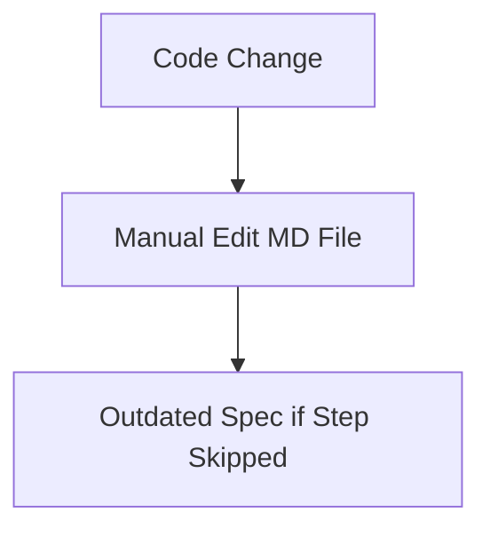
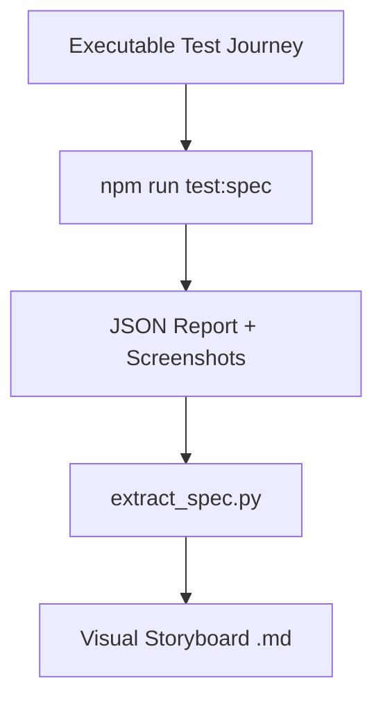

# Feature Specification Document: E2E-as-SSOT (Visual Storyboard)

## 1. Executive Summary

- **Feature**: E2E-as-SSOT (End-to-End Tests as Single Source of Truth)
- **Status**: Implemented (Prototype)
- **Summary**: This feature automates the generation of product feature specifications directly from executable Playwright E2E tests. By wrapping test actions in human-readable "User Intent" steps and automatically capturing screenshots, the system generates a "Visual Storyboard" in Markdown. This ensures that documentation is always synchronized with the actual application behavior and provides visual proof of feature correctness.

## 2. Design Philosophy & Guiding Principles

**Clarity vs. Power:**
- **Guiding Question**: Is the primary goal for this feature to be immediately understandable and simple, or to be feature-rich and powerful for expert users?
- **Our Principle**: Prioritize clarity. The generated storyboard must be readable by non-technical stakeholders (PMs, Designers) without needing to understand the underlying test code.

**Convention vs. Novelty:**
- **Guiding Question**: Should this feature leverage familiar, industry-standard patterns, or should we introduce a novel interaction to solve the problem in a unique way?
- **Our Principle**: Convention in tools, novelty in application. We use standard Playwright/Pytest tools but apply them in a novel way to bridge the gap between testing and documentation.

**Guidance vs. Freedom:**
- **Guiding Question**: How much should we guide the user? Should we provide a highly opinionated, step-by-step workflow, or give them a flexible "sandbox" to work in?
- **Our Principle**: Highly opinionated. The `step()` context manager enforces a linear, intent-based narrative for every test journey.

**Forgiveness vs. Strictness:**
- **Guiding Question**: How do we handle user error? Should the system prevent errors from happening, or make it easy to undo mistakes after they've been made?
- **Our Principle**: Strictness in verification. A specification is only generated if the underlying test passes, ensuring the "Truth" is actually verified.

**Aesthetic & Tone:**
- **Guiding Question**: What is the emotional goal of this feature? What should the user feel?
- **Our Principle**: Professional and trustworthy. The artifact should feel like a high-quality, "live" document that gives confidence in the product's stability.

## 3. Problem Statement & Goals

- **Problem**: "Documentation Drift." Manual feature specifications (like those in `docs/features/*.md`) quickly become outdated as the UI and logic evolve. Maintaining them is a chore that developers often skip, leading to a mismatch between what is documented and what actually works.
- **Goals**:
  - Goal 1: Establish a Single Source of Truth (SSOT) where the test *is* the specification.
  - Goal 2: Eliminate manual documentation maintenance for core user flows.
  - Goal 3: Provide visual verification (screenshots) for every documented requirement.
- **Success Metrics**:
  - Metric 1: 100% synchronization between generated spec and latest passing test run.
  - Metric 2: Zero manual edits required to `docs/features/image_joiner_spec.md` after setup.

## 4. Scope

- **In Scope:**
  - Python/Playwright test suite integration.
  - Custom `step()` context manager for capturing user intent and screenshots.
  - Automatic Markdown storyboard generation with embedded images.
  - Integration into `package.json` via `npm run test:spec`.
- **Out of Scope:**
  - Support for non-Playwright testing frameworks (e.g., Selenium, Cypress).
  - Generation of specs for non-UI features (e.g., pure API logic).
  - Multi-language localization of generated specs.

## 5. User Stories

- As a **Developer**, I want my feature documentation to update automatically when I change the code and update my tests, so that I never have to write a manual spec again.
- As a **Product Manager**, I want to see a visual step-by-step storyboard of a feature's core flow, so that I can verify the user experience matches the requirements without running the app.
- As a **QA Engineer**, I want the test reports to be formatted as human-readable specs, so that bugs can be identified in the context of user intent rather than just line numbers.

## 6. Acceptance Criteria

- **Scenario: Successful Spec Generation**
  - **Given**: A Playwright test exists with `with step(...)` blocks.
  - **When**: I run `npm run test:spec`.
  - **Then**: A JSON report is generated in `test-results/`.
  - **And**: Screenshots are captured for every step in `test-results/screenshots/`.
  - **And**: A Markdown file is created in `docs/features/` containing the step titles and images.

- **Scenario: Test Failure Blocks Spec Update**
  - **Given**: A test fails due to a bug in the app.
  - **When**: I run `npm run test:spec`.
  - **Then**: The exit code is non-zero.
  - **And**: The previous specification is NOT updated with incorrect/broken behavior (manual safeguard).

## 7. UI/UX Flow & Requirements

- **User Flow**:
  1. Developer writes a test journey in `tests/e2e/`.
  2. Developer uses `with step("Action", page):` to wrap logical blocks.
  3. Developer runs `npm run test:spec`.
  4. The system opens the browser, executes steps, takes screenshots, and writes the `.md` file.
- **Visual Design**: The generated Markdown uses standard GitHub-flavored Markdown with `[!IMPORTANT]` callouts and relative image paths.

## 8. Technical Design & Implementation

- **High-Level Approach**: We leverage `pytest-json-report` to capture the standard output of a test run. A custom Python context manager (`step`) prints markers to `stdout` which are then parsed by a Node.js-style extraction script.
- **Component Breakdown**:
  - `tests/e2e/test_image_joiner_ssot.py`: The "source" test journey.
  - `scripts/extract_spec.py`: The parsing engine.
  - `requirements-e2e.txt`: Python dependency manifest.
- **Key Logic**: The extraction script uses Regex to pair `--- STEP: ... ---` markers with `--- SCREENSHOT: ... ---` markers found in the JSON report's `stdout` field.

## 9. Data Management & Schema

### 9.1. Data Source
E2E test execution logs (`stdout`) and Playwright screenshot API.

### 9.2. Data Schema (Intermediate JSON)
```json
{
  "tests": [
    {
      "nodeid": "tests/e2e/test_image_joiner_ssot.py::test_func",
      "call": {
        "stdout": "--- STEP: ... ---\n--- SCREENSHOT: ... ---"
      }
    }
  ]
}
```

### 9.3. Persistence
The final specification is persisted as a Markdown file in `docs/features/`.

## 10. Storage Compatibility Strategy (Critical)

| Feature Aspect | Firebase (Cloud) | Google Drive (BYOS) | Static Mirror (R2) |
| :--- | :--- | :--- | :--- |
| **Data Storage** | N/A (Build time) | N/A (Build time) | N/A (Build time) |
| **Spec Access** | Git-based | Git-based | Publicly hosted .md |
| **Visual Evidence** | Stored in repo | Stored in repo | Stored in R2 assets |

## 11. Environment & Runtime Compatibility

| Feature Aspect | Local Dev (localhost) | AI Studio / Cloud IDE | Production (Deployed) |
| :--- | :--- | :--- | :--- |
| **Availability** | Full | Full (Headless) | N/A (Dev tool only) |
| **Behavior** | Manual trigger | CI trigger | Static viewing |

## 12. Manual Verification Script (QA)

### 12.1. Executable Validation Script
```javascript
(async () => {
  console.group('🧪 E2E-as-SSOT Verification');
  try {
     // Check for existence of the extraction script
     const response = await fetch('/scripts/extract_spec.py');
     if (!response.ok) throw new Error('Extraction script missing');
     
     // Check for the generated spec (assuming build artifacts are served)
     const spec = await fetch('/docs/features/image_joiner_spec.md');
     if (!spec.ok) console.warn('Spec might not be generated yet - run npm run test:spec');
     
     console.log('✅ SUCCESS: Tooling is in place');
  } catch (e) {
     console.error('❌ FAILED', e);
  }
  console.groupEnd();
})();
```

### 12.1. Happy Path (Core Workflow)
1. **Step**: Run `npm run test:spec` in the terminal.
   - **Expected**: Tests run, screenshots are taken, and "Successfully generated visual storyboard" is logged.
2. **Step**: Open `docs/features/image_joiner_spec.md`.
   - **Expected**: A formatted document with step titles and matching screenshots appears.

## 13. Limitations & Known Issues

- **Limitation 1**: Currently only supports Python/Pytest E2E tests.
- **Limitation 2**: Requires a running local server (`npm run dev`) to execute the tests.
- **Known Issue 1**: Screenshots might vary slightly between headless and headed modes.

## 14. Architectural Visuals

### Before: Manual Specification
Manual documentation depends on human discipline and is prone to error.



### After: Automated SSOT
The test execution *is* the documentation process.



## 15. Setup & Configuration Guide

### Step 1: Python Environment
1. Create a virtual environment: `python3 -m venv venv`
2. Activate: `source venv/bin/activate`
3. Install: `pip install -r requirements-e2e.txt`
4. Browser: `playwright install chromium`

### Step 2: Running the Pipeline
1. Start the app: `npm run dev`
2. Generate spec: `npm run test:spec`
